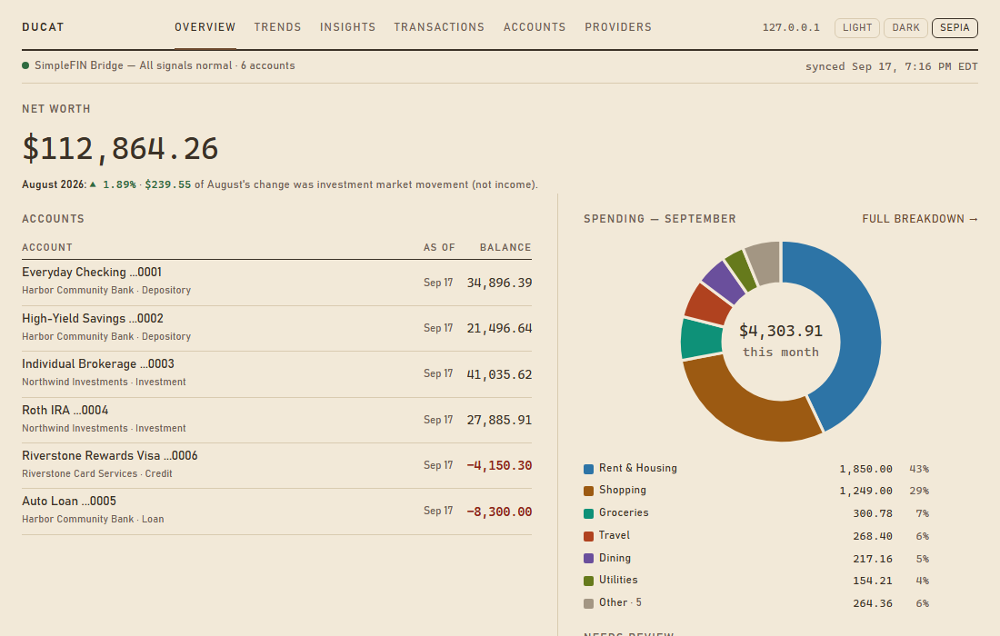
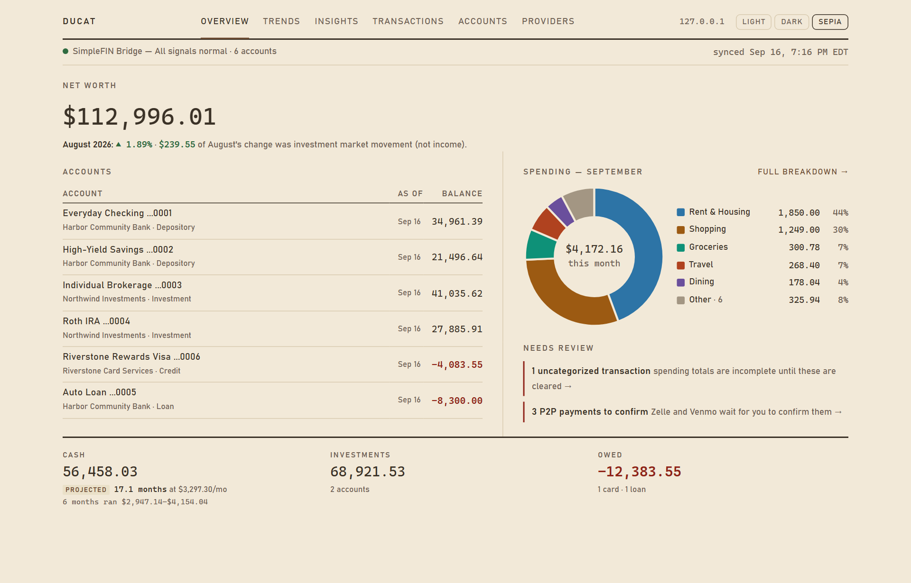
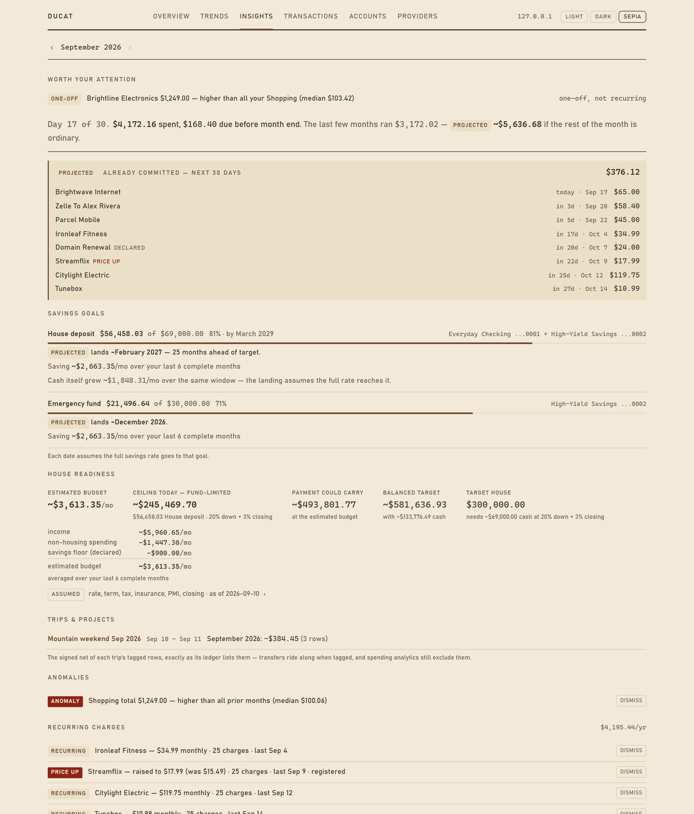
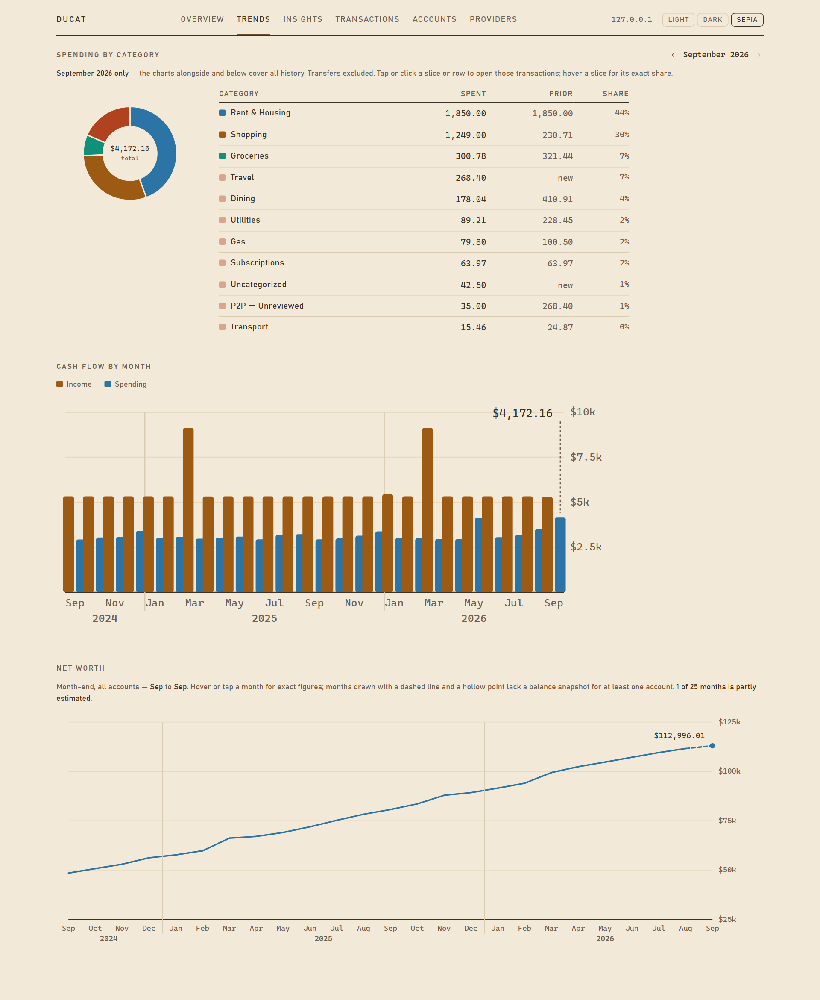
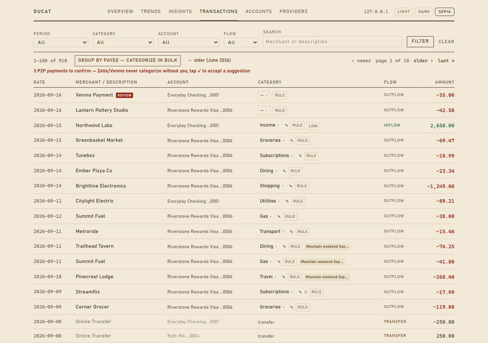

<p align="center">
  <picture>
    <source media="(prefers-color-scheme: dark)" srcset="docs/assets/ducat-banner-dark.svg">
    
  </picture>
</p>

<p align="center">
  <strong>Personal finance on your own machine, with an insights engine that refuses to guess.</strong>
</p>

<p align="center">
  <a href="https://github.com/achowlur/ducat/actions/workflows/ci.yml"></a>
  
  
  <a href="LICENSE"></a>
</p>

<p align="center">
  
</p>

Ducat pulls in your bank, card and brokerage accounts, categorizes every
transaction, and tells you where the month is heading: cash flow, spending,
net worth, recurring charges, savings goals, and the few things worth your
attention. It is **local-first**: the data is one SQLite file on your machine,
the server binds to `127.0.0.1`, and nothing leaves but calls to your own
SimpleFIN feed. No hosted service, no telemetry, no AI API, never a bank
credential. An optional single-tenant cloud mode runs on your own Vercel and
Turso behind a login that fails closed ([DEPLOY.md](DEPLOY.md)).

Every screenshot and the walkthrough above use invented demo data.

## What you get

<table>
  <tr>
    <td width="50%"></td>
    <td width="50%"></td>
  </tr>
  <tr>
    <td><strong>Overview</strong> — net worth, every account's balance and freshness, where this month's money went, and what needs review.</td>
    <td><strong>Insights</strong> — what's worth your attention, where the month lands, what's already committed, savings goals and a house-readiness estimate.</td>
  </tr>
  <tr>
    <td></td>
    <td></td>
  </tr>
  <tr>
    <td><strong>Trends</strong> — each category against last month, cash flow by month, and net worth split into what you saved and what markets did.</td>
    <td><strong>Transactions</strong> — a ledger where categorizing one payee can teach a rule, trips group spending across months, and Zelle or Venmo payments wait for your confirmation.</td>
  </tr>
</table>

## Built to be trusted

- **It refuses rather than fabricates.** Net worth for a month without a balance
  snapshot is marked unknown, never reconstructed; a percentage against a base
  of zero or below is withheld; a one-off purchase is never projected as a
  trend; a P2P payment is never categorized without you.
- **Money moving between your own accounts is not spending.** Transfers are
  paired across accounts and excluded from every analytic, and a category you
  set by hand is never overwritten by a rule.
- **Backups are proven, not assumed.** A nightly job copies the cloud database
  and checks whole-database content fingerprints before trusting the copy, then
  mirrors it locally only if nothing changed there since.
- **Nothing personal ships.** CI scans every file, commit message, branch name
  and pull request description for personal-data shapes, and the README's
  pictures come only from a command that seeds invented data.

## Architecture

- **Next.js 15** App Router on **React 19** — server components and server
  actions — in **TypeScript strict mode**.
- **Prisma 7** through the **libSQL** driver adapter: one client serves a local
  SQLite file and a Turso database; the `DATABASE_URL` scheme picks the mode.
- **Vitest**: 800+ tests, including integration tests on real migrated SQLite
  files; **ESLint 9**; Tailwind CSS 4; charts are hand-rolled SVG.
- **Layers depend downward only**: connectors → normalized schema
  (`src/types/contracts.ts`) → insights engine → UI.
- **CI** runs typecheck, lint, tests, the personal-data checks and a screenshot
  sync check; `main` changes only through a pull request with a green `verify`.

## How data flows

1. **Ingest.** The SimpleFIN connector reads your own feed; the CSV connector
   imports Chase, Wells Fargo and Fidelity exports into the same normalized
   accounts and signed transactions.
2. **Sync, in a fixed order** (`src/lib/sync/`): upsert accounts → balance
   snapshots → deduplicated import → category rules → transfers → insights.
3. **Categorize.** Your rules, then a shipped pack of merchant and
   statement-descriptor rules; the first match wins.
4. **Detect transfers.** Exact opposite amounts in two of your accounts within
   four days are paired and excluded from spending and income.
5. **Insights** (`src/lib/insights/`): cash flow, spending by category, net
   worth split into contributions and market movement, recurring charges and
   ranked anomalies, stored per period for the pages to read.

## Run it locally

Requires Node.js 22 or newer.
```bash
npm ci
cp .env.example .env            # local mode works with the defaults
npx prisma migrate deploy       # creates ./data/ducat.db
npm run db:seed                 # optional: invented demo data, dated up to today
npm run dev                     # http://127.0.0.1:3000
npm test                        # the Vitest suite
```

For real data, run `npm run simplefin:claim -- <setup-token>` then
`npm run sync:simplefin`, or import CSVs with `npm run import:csv`
([docs/csv-import.md](docs/csv-import.md)). The full walkthrough is
[docs/getting-started.md](docs/getting-started.md).

## Engineering rules

[CLAUDE.md](CLAUDE.md) holds the project's enforceable rules, one line each, and
[docs/conventions/](docs/conventions/) holds the evidence behind every one.

## Commands

<details>
<summary>Every operator command</summary>

| Command | What it does |
| --- | --- |
| `npm run dev` | Dev server, bound to `127.0.0.1` |
| `npm test` | Vitest suite |
| `npm run db:seed` | Load invented demo data dated relative to today — two years of history for six accounts, goals, house readiness, a trip and P2P payments to confirm — then install the rule pack and build insights, so every screen has something to show. Destructive: wipes accounts, transactions, rules, insights and the data's Settings; refuses over existing transactions without `-- --yes` — names the database first |
| `npm run screenshots` | Retake the README's screenshots and walkthrough from invented demo data: seeds a throwaway database, builds the app into `.next-capture/` (never `.next/`, so it is safe beside a running dev server), and drives Playwright's own Chromium. Needs `npx playwright install chromium` once. Never touches `data/ducat.db` |
| `npm run db:reset` | Wipe every row **including** `Setting`, so the next sync refetches full history rather than a short incremental window — destructive and irreversible; refuses without `-- --yes` |
| `npm run insights:generate` | Regenerate insights (`-- --granularity=WEEK\|MONTH\|QUARTER\|YEAR`) — names the database first |
| `npm run simplefin:claim` | Exchange a one-time SimpleFIN setup token (`-- <setup-token>`) for the permanent access URL — prints the `SIMPLEFIN_ACCESS_URL` line to paste into `.env`, and never writes a secret to a file itself |
| `npm run sync:simplefin` | Sync from your SimpleFIN feed (`-- --since=YYYY-MM-DD` widens the window, `--granularity=MONTH`) — names the database first |
| `npm run import:csv` | Import a CSV (`-- <file.csv> --mapping=… --name=… --type=… --institution=…`; `--dry-run` reports what it would do and writes nothing) — names the database first |
| `npm run import:balances` | Import month-end balance snapshots for investment accounts (`-- --template [--months=N]` prints a fill-in CSV; `--dry-run` previews) — names the database first |
| `npm run upgrade` | After `git pull`, bring this database up to the checked-out code: install missing pack rules if any are pending, then regenerate the monthly insight rows — always, so a release that changed only analyzer math reaches the screens too (`-- --check` reports without writing). Writes rows on every real run, so run it against the CLOUD; the nightly backup mirrors local from it — names the database first |
| `npm run rules:retarget` | Edit existing rules in place — category, match field or match operator — and re-apply (`-- --match=<value,value>` plus at least one of `--category="<Name>"`, `--field=<FIELD>`, `--operator=<OP>`; dry run, `--apply` writes) — names the database first |
| `npm run rules:install` | Install the starter category-rule pack and retroactively categorize existing transactions (idempotent: re-running adds only what is missing) — names the database first |
| `npm run rules:audit` | Report rules that match more merchants than the one they were built from (read-only) — names the database first |
| `npm run rules:simulate` | Report every disagreement between the current and the retired CONTAINS matcher, over real rows plus generated probes (read-only) — names the database first |
| `npm run goals` | List/declare savings goals shown on /insights (`-- --add --name=… --target=…` or `--house-price=… [--down=20 --closing=3]`, `--accounts=<list>` or `--accounts=cash`, optional `--by=YYYY-MM`; `--remove=…`) — names the database first |
| `npm run readiness` | List/declare the house-readiness config behind /insights' readiness panel (`-- --floor=… --rate=… --term=… --tax=… --insurance=… --pmi=… --closing=… --down=…`, all equals-form; `--as-of=YYYY-MM-DD` dates a typed rate, `--fetched-rate` uses the stored FRED observation instead, `--clear` removes the panel) — names the database first |
| `npm run accounts:cash` | List which accounts count as spendable cash; mark non-checking ones (`-- --add=…` / `-- --remove=…`) — names the database first |
| `npm run health` | Print the provider-health panel and the tracked-subscription reconciliation (read-only, no network) |
| `npm run subs:audit` | Report what subscription detection missed and which gate rejected it (read-only) — names the database first |
| `npm run repair:text` | Strip undecodable characters from imported names/descriptions (dry run; `-- --apply` writes) |
| `npm run repair:merchants` | Re-normalize stored merchant names after a normalizer change (dry run; `-- --apply` writes) |
| `npm run auth:set-password` | Generate the login gate's `AUTH_PASSWORD_HASH` and `SESSION_SECRET` — you type the password into the terminal (echo muted, 8 characters minimum, asked twice); the values are printed to paste into `.env` or Vercel and nothing is stored |
| `npm run auth:set-totp` | Generate the opt-in second factor `AUTH_TOTP_SECRET` and prove enrollment before deploying it — asks for one code from your authenticator and refuses the secret if it does not verify (offline; nothing stored). Enabling or rotating it logs out every session |
| `npm run turso:push` | Apply the schema to a fresh cloud database (see [DEPLOY.md](DEPLOY.md)) |
| `npm run schema:push` | Diff `prisma/schema.prisma` against a database that already has data and apply the additive part (dry run; `-- --apply` writes) — names the database first |
| `npm run turso:copy` | Copy this database into a fresh cloud one (dry run; `-- --apply` writes) |
| `npm run cloud:backup` | Pull the cloud database into a dated file under `data/backups/` |
| `npm run backup:scheduled` | The nightly cloud→local backup the 00:30 UTC task fires: copy, fingerprint-verify (a mismatch quarantines as `.unverified`), prune retention, make `data/ducat.db` a copy of the verified file (only if nothing has written to local since its last mirror; otherwise local is left untouched and the refusal shows on /providers), then record `backup.lastRun`. Credentials come from `.env.backup` only, never `.env` or the shell. `-- --dry-run` still copies and verifies, and skips the pruning, the mirror and the Setting |
| `npm run db:mirror` | Make `data/ducat.db` a copy of the newest verified backup, on demand — reports both digests and whether local changed since its last mirror, and writes nothing without `-- --confirm` (which first keeps the current local as `data/ducat-superseded-<date>.db`). Run it once to start the nightly mirror |
| `npm run db:fingerprint` | Print per-table and whole-database content digests — the read-only proof that two databases hold identical rows, where counts and sums are blind (a changed category, a flipped `dismissed`) — names the database first |

"Names the database first" means the first line says which database it will
touch — read it. In cloud mode, change data on the cloud; the nightly backup
mirrors local ([docs/lifecycle.md](docs/lifecycle.md)). `npm run build` and
`npm run start` are left out on purpose: measure performance on the deployment,
and never build while the dev server runs — they share `.next/`.

</details>

## Status and license

A personal project published as a portfolio piece, not a product: no releases,
no roadmap and no promised support. Licensed under AGPL-3.0 ([LICENSE](LICENSE)).
