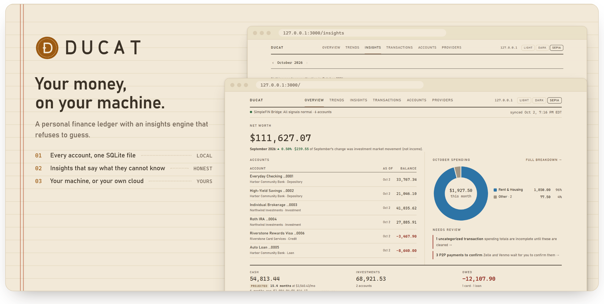
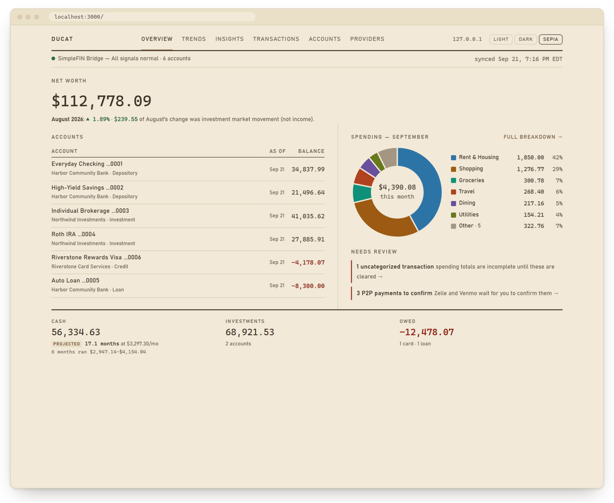
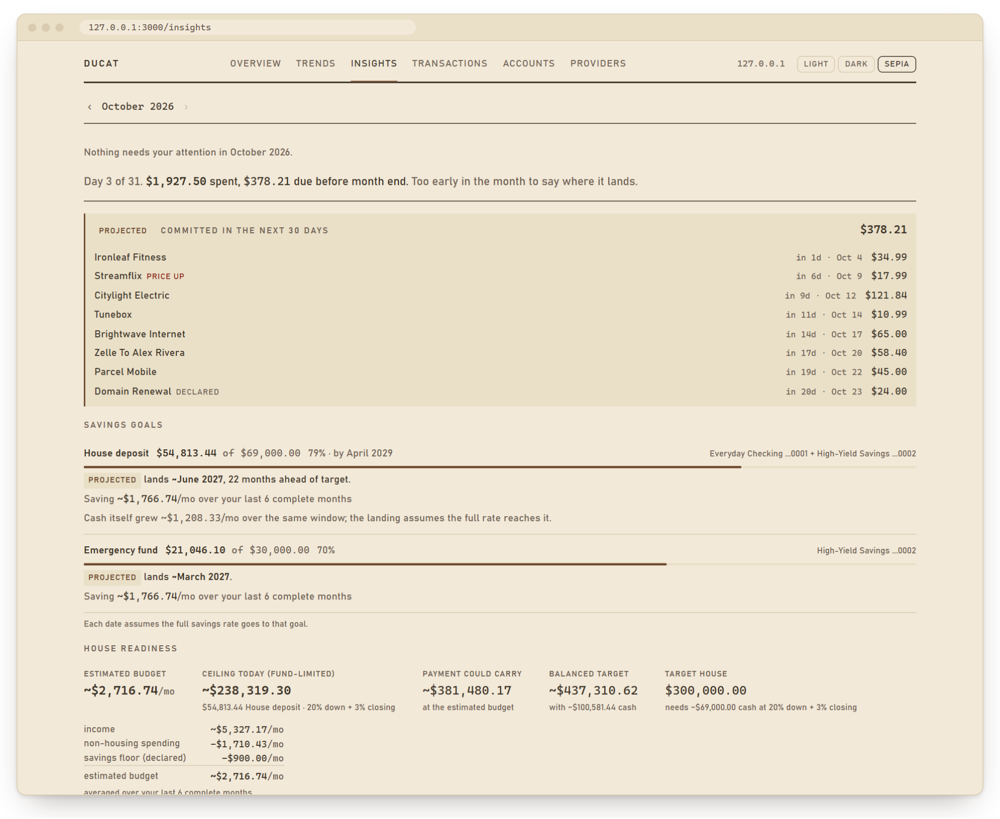
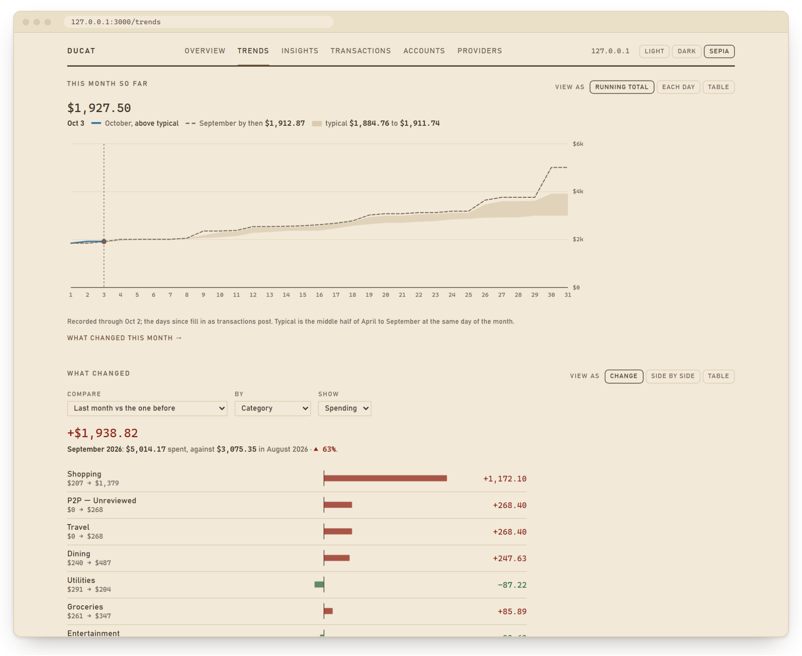
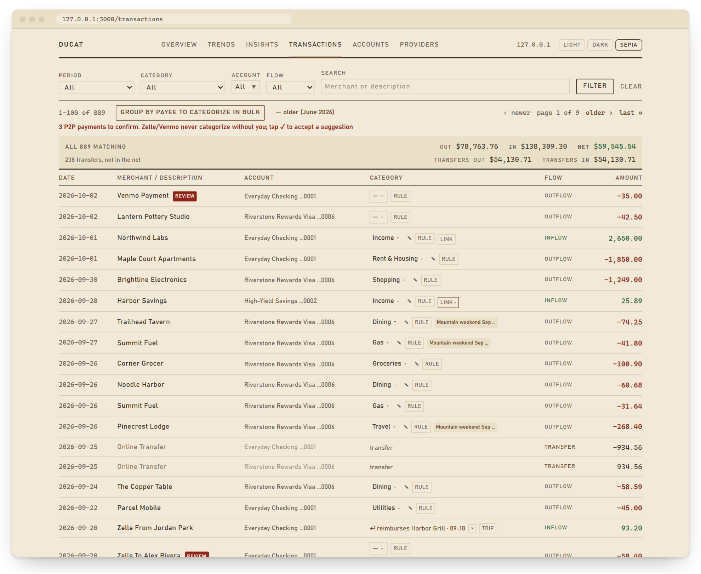
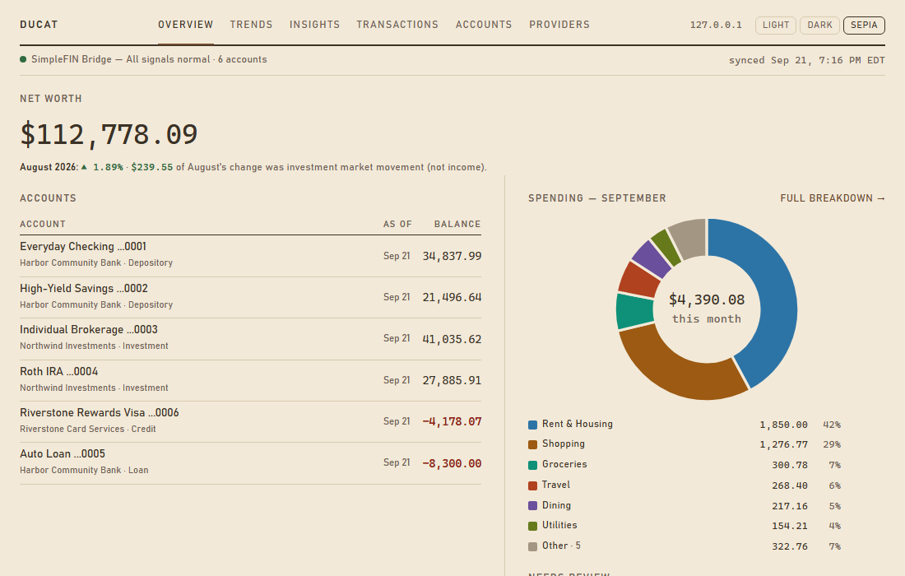

<p align="center">
  <a href="https://ducat-demo.vercel.app"></a>
</p>

<h3 align="center">
  <a href="https://ducat-demo.vercel.app">Live demo</a> ·
  <a href="docs/getting-started.md">Get started</a> ·
  <a href="DEPLOY.md">Deploy your own</a> ·
  <a href="#how-data-flows">How it works</a>
</h3>

<p align="center">
  <sub>Demo password <code>ducat-demotest*</code> · every figure in it is invented · it resets every night</sub>
</p>

<p align="center">
  <a href="https://github.com/achowlur/ducat/actions/workflows/ci.yml"></a>
  
  
  <a href="LICENSE"></a>
</p>

Ducat pulls in your bank, card and brokerage accounts, categorizes every
transaction, and tells you where the month is heading: cash flow, spending,
net worth, recurring charges, savings goals, and the few things worth your
attention. It is local-first. The data is one SQLite file on your machine, the
server binds to `127.0.0.1`, and the only outbound connection is to your own
SimpleFIN feed. No hosted service, no telemetry, no AI API, never a bank
credential. If you want it on your phone, an optional cloud mode runs on your
own Vercel and Turso behind a login that fails closed ([DEPLOY.md](DEPLOY.md)).

Every screenshot, the walkthrough and the [live demo](https://ducat-demo.vercel.app)
use invented data. The demo resets every night, so change anything you like there.

## What you get

### Overview



Net worth is the plain sum of your balances. Below it, every account with the
date its balance was last confirmed, this month's spending by category, and
the things waiting for your review.

### Insights



The month, read once: what is worth your attention, where spending lands if
the rest of the month is ordinary, what is already committed, each savings
goal with the date it lands, and a house-readiness estimate that names its
assumptions.

### Trends



This month's spending against last month and what is typical by the same day,
what changed since the month before and where (category, merchant, card or
account), a report you build yourself in the chart you choose, and net worth
split into what you saved and what the markets did. Every figure opens the
transactions behind it.

### Transactions



The ledger. Categorizing one payee can teach a rule, a trip groups spending
across months, and a Zelle or Venmo payment waits for you to confirm what it
was.

## See it in action

<p align="center">
  
</p>

## What it will not do

Ducat would rather say "unknown" than guess. An investment account with no
balance snapshot in a month shows net worth as unknown for that month rather
than a figure reconstructed from transactions. A percentage against a base of
zero or below is withheld. One large purchase is scored once, as a one-off,
and never annualised into a trend. A Zelle or Venmo payment is not categorized
until you confirm it, because the same person can be paid for different
things.

Money moving between your own accounts is not spending. Transfers are paired
across accounts (exact opposite amounts within four days) and left out of
every total, and a category you set by hand is never overwritten by a rule.

The same care goes into what surrounds the app. The nightly backup copies the
cloud database and compares whole-database fingerprints before it trusts the
copy, then mirrors it to the local machine only if nothing has written there
since. CI reads every file, commit message, branch name and pull request for
the shapes personal data takes, and the pictures above come from one command
that seeds invented data into a throwaway database.

## Architecture

Next.js 15 (App Router, React 19, server actions) in strict TypeScript. Prisma
7 through the libSQL driver adapter, so one client serves both a local SQLite
file and a Turso database; the `DATABASE_URL` scheme picks the mode. Tailwind
CSS 4 for styling. The charts are hand-rolled SVG, with no chart library and
no webfonts. Vitest runs 800-odd tests, including integration tests against
real migrated SQLite files, and ESLint 9 sits beside it. The layers depend
downward only: connectors, then the normalized schema in
`src/types/contracts.ts`, then the insights engine, then the UI. CI runs the
typecheck, the lint, the tests, the personal-data checks and a screenshot-sync
check, and `main` changes only through a pull request with a green `verify`.

## How data flows

1. The SimpleFIN connector reads your own feed. The CSV connector imports
   Chase, Wells Fargo and Fidelity exports into the same normalized accounts
   and signed transactions.
2. A sync runs in a fixed order (`src/lib/sync/`): upsert accounts, write
   balance snapshots, import with deduplication, apply category rules, pair
   transfers, regenerate insights.
3. Categories come from your own rules first, then from a shipped pack of
   merchant and statement-descriptor rules. The first match wins.
4. Transfers are exact opposite amounts in two of your accounts within four
   days. They are paired and left out of spending and income.
5. The insights engine (`src/lib/insights/`) stores rows per period: cash
   flow, spending by category, net worth split into contributions and market
   movement, recurring charges, and ranked anomalies. The pages read those
   rows.

## Run it locally

Requires Node.js 22 or newer.
```bash
npm ci
cp .env.example .env            # local mode works with the defaults
npx prisma migrate deploy       # creates ./data/ducat.db
npm run db:seed                 # optional: invented demo data, dated up to today
npm run dev                     # http://127.0.0.1:3000
npm test                        # the Vitest suite
```

For real data, run `npm run simplefin:claim -- <setup-token>` then
`npm run sync:simplefin`, or import CSVs with `npm run import:csv`
([docs/csv-import.md](docs/csv-import.md)). The full walkthrough is
[docs/getting-started.md](docs/getting-started.md).

## Engineering rules

[CLAUDE.md](CLAUDE.md) holds the rules every change has to keep.
[.claude/rules/](.claude/rules/) holds the rules for each area of the code, and
each file loads when a file in its area is opened.
[.claude/skills/](.claude/skills/) holds procedures, such as the pre-commit gate
and shipping a pull request.
[docs/conventions/](docs/conventions/) holds the evidence behind every rule.

## Commands

<details>
<summary>Every operator command</summary>

| Command | What it does |
| --- | --- |
| `npm run dev` | Dev server, bound to `127.0.0.1` |
| `npm test` | Vitest suite |
| `npm run db:seed` | Load invented demo data dated relative to today (two years of history for six accounts, goals, house readiness, a trip and P2P payments to confirm), then install the rule pack and build insights, so every screen has something to show. Destructive: wipes accounts, transactions, rules, insights and the data's Settings, and refuses over existing transactions without `-- --yes` |
| `npm run screenshots` | Retake the README's banner, framed screenshots and walkthrough from invented demo data: seeds a throwaway database, builds the app into `.next-capture/` (never `.next/`, so it is safe beside a running dev server), and drives Playwright's own Chromium. Needs `npx playwright install chromium` once. Never touches `data/ducat.db` |
| `npm run db:reset` | Wipe every row **including** `Setting`, so the next sync refetches full history rather than a short incremental window. Destructive and irreversible; refuses without `-- --yes` |
| `npm run insights:generate` | Regenerate insights (`-- --granularity=WEEK\|MONTH\|QUARTER\|YEAR`) |
| `npm run simplefin:claim` | Exchange a one-time SimpleFIN setup token (`-- <setup-token>`) for the permanent access URL. Prints the `SIMPLEFIN_ACCESS_URL` line to paste into `.env` and never writes a secret to a file itself |
| `npm run sync:simplefin` | Sync from your SimpleFIN feed (`-- --since=YYYY-MM-DD` widens the window, `--granularity=MONTH`) |
| `npm run import:csv` | Import a CSV (`-- <file.csv> --mapping=… --name=… --type=… --institution=…`; `--dry-run` reports what it would do and writes nothing) |
| `npm run import:balances` | Import month-end balance snapshots for investment accounts (`-- --template [--months=N]` prints a fill-in CSV; `--dry-run` previews) |
| `npm run upgrade` | After `git pull`, bring this database up to the checked-out code: install missing pack rules if any are pending, reapply the rules to stored rows, then regenerate the monthly insight rows, always, so a release that changed only analyzer math or classification reaches the screens too (`-- --check` reports without writing). Writes rows on every real run, so run it against the CLOUD; the nightly backup mirrors local from it |
| `npm run rules:retarget` | Edit existing rules in place (category, match field or match operator) and re-apply: `-- --match=<value,value>` plus at least one of `--category="<Name>"`, `--field=<FIELD>`, `--operator=<OP>`. Dry run; `--apply` writes |
| `npm run rules:install` | Install the starter category-rule pack and retroactively categorize existing transactions. Idempotent: re-running adds only what is missing |
| `npm run rules:audit` | Report rules that match more merchants than the one they were built from (read-only) |
| `npm run rules:simulate` | Report every disagreement between the current and the retired CONTAINS matcher, over real rows plus generated probes (read-only) |
| `npm run goals` | List or declare savings goals shown on /insights (`-- --add --name=… --target=…` or `--house-price=… [--down=20 --closing=3]`, `--accounts=<list>` or `--accounts=cash`, optional `--by=YYYY-MM`; `--remove=…`) |
| `npm run readiness` | List or declare the house-readiness config behind /insights' readiness panel (`-- --floor=… --rate=… --term=… --tax=… --insurance=… --pmi=… --closing=… --down=…`, all equals-form; `--as-of=YYYY-MM-DD` dates a typed rate, `--fetched-rate` uses the stored FRED observation instead, `--clear` removes the panel) |
| `npm run accounts:cash` | List which accounts count as spendable cash, and mark non-checking ones (`-- --add=…` / `-- --remove=…`) |
| `npm run health` | Print the provider-health panel and the tracked-subscription reconciliation (read-only, no network) |
| `npm run subs:audit` | Report what subscription detection missed and which gate rejected it (read-only) |
| `npm run repair:text` | Strip undecodable characters from imported names and descriptions (dry run; `-- --apply` writes) |
| `npm run repair:merchants` | Re-normalize stored merchant names after a normalizer change (dry run; `-- --apply` writes) |
| `npm run auth:set-password` | Generate the login gate's `AUTH_PASSWORD_HASH` and `SESSION_SECRET`. You type the password into the terminal (echo muted, 8 characters minimum, asked twice); the values are printed to paste into `.env` or Vercel, and nothing is stored |
| `npm run auth:set-totp` | Generate the opt-in second factor `AUTH_TOTP_SECRET` and prove enrollment before deploying it: asks for one code from your authenticator and refuses the secret if it does not verify (offline; nothing stored). Enabling or rotating it logs out every session |
| `npm run turso:push` | Apply the schema to a fresh cloud database (see [DEPLOY.md](DEPLOY.md)) |
| `npm run schema:push` | Diff `prisma/schema.prisma` against a database that already has data and apply the additive part (dry run; `-- --apply` writes) |
| `npm run turso:copy` | Copy this database into a fresh cloud one (dry run; `-- --apply` writes) |
| `npm run cloud:backup` | Pull the cloud database into a dated file under `data/backups/` |
| `npm run backup:scheduled` | The nightly cloud-to-local backup the 00:30 UTC task fires: copy, fingerprint-verify (a mismatch quarantines as `.unverified`), prune retention, make `data/ducat.db` a copy of the verified file (only if nothing has written to local since its last mirror; otherwise local is left untouched and the refusal shows on /providers), then record `backup.lastRun`. Credentials come from `.env.backup` only, never `.env` or the shell. `-- --dry-run` still copies and verifies, and skips the pruning, the mirror and the Setting |
| `npm run db:mirror` | Make `data/ducat.db` a copy of the newest verified backup, on demand. Reports both digests and whether local changed since its last mirror, and writes nothing without `-- --confirm` (which first keeps the current local as `data/ducat-superseded-<date>.db`). Run it once to start the nightly mirror |
| `npm run db:fingerprint` | Print per-table and whole-database content digests: the read-only proof that two databases hold identical rows, where counts and sums are blind (a changed category, a flipped `dismissed`) |

Every command that opens a database prints which one on its first line. Read
it. In cloud mode, data changes go to the cloud and the nightly backup mirrors
them to local ([docs/lifecycle.md](docs/lifecycle.md)). `npm run build` and
`npm run start` are left out on purpose: measure performance on the
deployment, and never build while the dev server runs, since they share
`.next/`.

</details>

## Status and license

A personal project published as a portfolio piece, not a product: no releases,
no roadmap and no promised support. Licensed under AGPL-3.0 ([LICENSE](LICENSE)).
